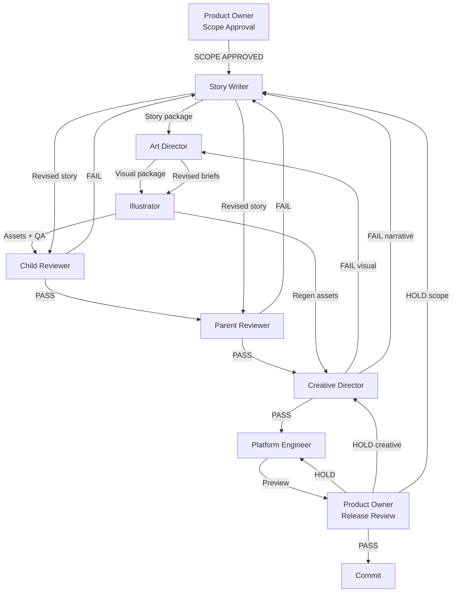

# AdventureBox Creative Workflow

**Version:** v0.3.0  
**Purpose:** End-to-end production path for every premium story

---

## Overview

Every AdventureBox story follows the same pipeline. Agents run in order. Review gates cannot be skipped. Revision loops return work to the **lowest agent who can fix the issue** — not always to the start.

One developer plays all roles. Switch hats explicitly: *"I am now Child Reviewer."*

---

## Master Flow



---

## Phase 0 — Scope (Product Owner)

**When:** Before any creative work  
**Duration:** 15–30 minutes  
**Agent:** [05_product_owner.md](./05_product_owner.md)

### Actions

1. Confirm story fits roadmap phase
2. Write scope approval: title, pages, age band, hero, interaction, out-of-scope, target version
3. Verify weekend sprint is realistic

### Exit gate

```
SCOPE APPROVED → Story Writer may begin
SCOPE HOLD     → Do not start
```

---

## Phase 1 — Story (Story Writer)

**When:** After scope approval  
**Duration:** 2–4 hours  
**Agent:** [01_story_writer.md](./01_story_writer.md)

### Actions

1. Write publishing summary (`README.md`)
2. Write page briefs with story text + scene descriptions
3. Define emotional arc and end line
4. Spec interaction page (if approved)

### Deliverables

- `storybook/README.md` (or story folder equivalent)
- `PAGE_01.md` through `PAGE_05.md`

### Exit gate

Story package complete → handoff to Art Director

---

## Phase 2 — Visual Direction (Art Director)

**When:** After story package  
**Duration:** 2–3 hours  
**Agent:** [02_art_director.md](./02_art_director.md)

### Actions

1. Write Art Direction Bible
2. Lock character colors and proportions
3. Write copy-paste illustration prompts per page
4. Write cover brief
5. Define file naming and QA checklist

### Deliverables

- `ART_DIRECTION.md`
- `COVER.md`
- Updated page briefs with prompts

### Exit gate

Visual package complete → handoff to Illustrator

---

## Phase 3 — Illustration (Illustrator)

**When:** After visual package  
**Duration:** 3–6 hours  
**Agent:** [03_illustrator.md](./03_illustrator.md)

### Actions

1. Generate Page 1 → Page 5 in order
2. Generate cover
3. Run Image QA checklist per asset
4. Side-by-side consistency review
5. Save assets with correct names

### Deliverables

- PNG assets in `storybook/assets/`
- Completed QA checklist
- Generation log

### Exit gate

Illustration package complete → enter review pipeline

---

## Phase 4 — Reviews

Reviews run **in order**. Earlier passes are not invalidated until a later review fails.

### 4a — Child Review

**Agent:** [06_child_reviewer.md](./06_child_reviewer.md)

| Result | Next step |
|--------|-----------|
| PASS | → Parent Review |
| FAIL | → **Story Writer** (revision loop ↺) |

**Revision loop ↺ Child:**

```
FAIL → Story Writer revises text/interaction
     → If art still valid: re-review text only
     → If scene changed: Art Director → Illustrator (partial)
     → Child Reviewer re-runs
     → Max 2 loops → escalate Creative Director
```

---

### 4b — Parent Review

**Agent:** [07_parent_reviewer.md](./07_parent_reviewer.md)  
**Prerequisite:** Child Review PASS

| Result | Next step |
|--------|-----------|
| PASS | → Creative Director |
| FAIL | → **Story Writer** (revision loop ↺) |

**Revision loop ↺ Parent:**

```
FAIL → Story Writer revises (length, tone, calmness, safety in text)
     → If visual safety issue: Art Director → Illustrator
     → Parent Reviewer re-runs
     → Max 2 loops → escalate Creative Director
```

**Note:** Child and Parent failures both return to Story Writer first — because words fix most review failures. Visual safety escalates to Art Director.

---

### 4c — Creative Director

**Agent:** [08_creative_director.md](./08_creative_director.md)  
**Prerequisites:** Child PASS + Parent PASS

| Result | Next step |
|--------|-----------|
| PASS | → Platform Engineer |
| FAIL (visual) | → **Art Director** → Illustrator → Creative Director re-review |
| FAIL (narrative) | → **Story Writer** → re-run Child + Parent if material change |

**Revision loop ↺ Creative (visual):**

```
FAIL → Art Director: specific page notes
     → Illustrator: regen affected pages only
     → Side-by-side re-check
     → Creative Director: art-only re-review
     → (Skip Child/Parent if text unchanged)
```

**Revision loop ↺ Creative (narrative):**

```
FAIL → Story Writer revises
     → Child + Parent re-run if text materially changed
     → Creative Director full re-review
```

---

## Phase 5 — Integration (Platform Engineer)

**When:** After Creative Director PASS only  
**Duration:** 1–3 hours  
**Agent:** [04_platform_engineer.md](./04_platform_engineer.md)

### Actions

1. Wire story data into Story Reader
2. Link approved assets
3. Wire interaction page
4. Verify accessibility + performance
5. Add to story library

### Rules

- **Never** edit creative content
- **Never** start before Creative Director PASS
- Escalate creative issues — do not patch in code

### Exit gate

Preview ready → Product Owner release review

---

## Phase 6 — Release (Product Owner)

**When:** After Platform Engineer handoff  
**Duration:** 30–60 minutes  
**Agent:** [05_product_owner.md](./05_product_owner.md)

### Actions

1. Run release checklist
2. Verify all review PASSes documented
3. Confirm scope fidelity
4. Draft release notes
5. Issue PASS or HOLD

| Result | Next step |
|--------|-----------|
| PASS | → **Commit authorized** |
| HOLD (engineering) | → Platform Engineer |
| HOLD (creative) | → Creative Director |
| HOLD (scope) | → Story Writer + re-approval |

---

## Revision Loop Summary

| Failed at | Returns to | May also involve |
|-----------|------------|------------------|
| Child Reviewer | Story Writer | Art Director, Illustrator |
| Parent Reviewer | Story Writer | Art Director, Illustrator |
| Creative Director (visual) | Art Director | Illustrator |
| Creative Director (narrative) | Story Writer | Child, Parent re-review |
| Product Owner (release) | Platform Engineer | or upstream agent |

**Max revision cycles:** 2 per review agent, then Product Owner calls HOLD or descopes.

---

## Weekend Sprint Timeline

Default one-story weekend:

| Block | Phase | Agent |
|-------|-------|-------|
| **Sat AM** | Scope + Story | Product Owner → Story Writer |
| **Sat PM** | Visual direction + Page 1–2 art | Art Director → Illustrator |
| **Sun AM** | Page 3–5 art + reviews | Illustrator → Child → Parent |
| **Sun PM** | Creative sign-off + ship | Creative Director → Engineer → Product Owner |

If Sunday PM cannot complete → **HOLD**. Do not commit partial work.

---

## Parallel Work (Allowed)

| Parallel | Condition |
|----------|-----------|
| Cover generation while pages run | Same Illustrator, same bible |
| Art Director cover brief while Illustrator on Page 1 | After bible locked |
| Release notes draft while Engineer integrates | After Creative PASS |

**Never parallel:** Story writing + scope approval. Reviews + illustration of unreviewed story text.

---

## Checklist — Story Complete

Before commit, verify:

- [ ] Product Owner scope approval on file
- [ ] Story Writer package complete
- [ ] Art Direction Bible complete
- [ ] All assets QA passed
- [ ] Child Review: PASS
- [ ] Parent Review: PASS
- [ ] Creative Director: PASS
- [ ] Platform Engineer: preview working
- [ ] Product Owner: RELEASE PASS
- [ ] No placeholder assets
- [ ] No unapproved scope

---

## Quick Reference — Agent Order

```
1. Product Owner      (scope)
2. Story Writer
3. Art Director
4. Illustrator
5. Child Reviewer      ──fail──→ Story Writer
6. Parent Reviewer     ──fail──→ Story Writer
7. Creative Director   ──fail──→ Art Director or Story Writer
8. Platform Engineer
9. Product Owner       (release)
10. Commit
```

---

*AdventureBox Creative Workflow · v0.3.0 · Awaiting Product Owner review*
