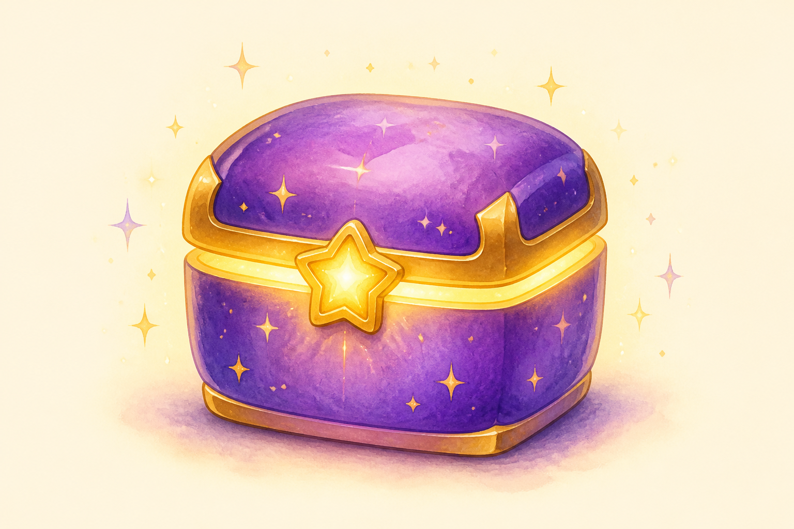

# AdventureBox — The Magical Box
## Official Brand Icon

The treasure box is AdventureBox. Children open the box; stories come out.

---

## Icon Art



**File:** `assets/adventurebox-icon.png`

---

## Design Specification

| Element | Detail |
|---------|--------|
| **Shape** | Rounded treasure chest — friendly, not pirate-scary |
| **Body color** | Adventure Purple `#6C5CE7` with subtle star pattern |
| **Trim** | Treasure Gold `#FDCB6E` — lid edge, corners, clasp |
| **Clasp** | Five-point golden star — glows warm |
| **Magic** | Light spilling from lid seam — wonder is inside |
| **Sparkles** | 4–6 floating stars around box — subtle, not chaotic |
| **Shadow** | Soft purple ground shadow — box feels present, not floating |

---

## Personality

| Attribute | Expression |
|-----------|------------|
| **Feeling** | "Something wonderful is inside" |
| **Not** | Locked, scary, commercial, gamified |
| **Sound** | Soft click, gentle glow — not slot machine |

---

## Usage Map

| Surface | Treatment |
|---------|-----------|
| **App icon** | Box centered, cream or soft gradient background, no text |
| **Website** | Header mark, 40px height minimum |
| **Book cover** | Bottom center, beside "AdventureBox" wordmark |
| **Story ending** | Box appears closed with sticker beside it — "Another adventure awaits" |
| **Favicon** | Simplified box + star clasp only |

---

## Simplified Icon (Favicon / Small Sizes)

At sizes below 64px:
- Remove sparkles
- Keep purple body + gold star clasp only
- Increase contrast on clasp

---

## Do-Nots

- ❌ Open box revealing characters (clutter at small size)
- ❌ Text inside icon
- ❌ Harsh 3D render or metallic chrome
- ❌ Lock and key (feels restrictive)
- ❌ Coin slot, gems, loot box aesthetics

---

## Wordmark Pairing

```
[icon] AdventureBox
```

Fredoka Semibold · `#2D3436` on light · `#FFF9F0` on dark

---

*AdventureBox Icon v1.0 · Focus Sprint*
