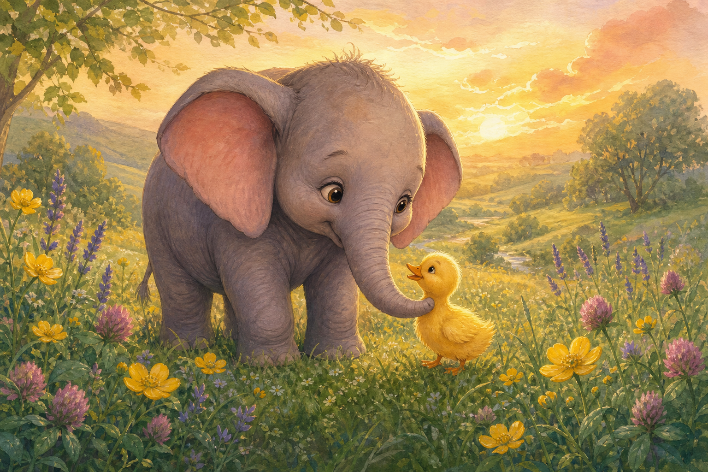

# Premium Book Cover
## *Ellie and the Tiny Lost Duck*

---

## Cover Art



**File:** `assets/cover.png`  
**Ratio:** Portrait ~2:3 (book cover)  
**Resolution:** Production-ready raster

---

## Title Treatment (Overlay — not baked into art)

```
ELLIE AND THE
TINY LOST DUCK
```

| Property | Value |
|----------|-------|
| Font | Fredoka Bold |
| Color | `#FFF9F0` with subtle shadow |
| Position | Lower third, centered |
| Subtitle | None on cover — story speaks for itself |

---

## Brand Mark (Overlay)

```
[✦ box icon]  AdventureBox
```

| Property | Value |
|----------|-------|
| Font | Fredoka Semibold |
| Size | ≤ 8% cover height |
| Position | Bottom center |
| Icon | See [ADVENTUREBOX_ICON.md](./ADVENTUREBOX_ICON.md) |

---

## Cover Composition

- **Ellie** — center, trunk curved toward duck, tender eye contact
- **Tiny Duck** — at Ellie's feet, size contrast is the hook
- **Environment** — golden hour meadow, wildflowers, rolling hills
- **Mood** — warm friendship, bookstore premium, parent stops scrolling

---

## Production Prompt (Reference)

Full prompt preserved in `/storybook/PAGE_02` cover section and brand `COVERS.md`. Regenerate only against [ELLIE_CHARACTER_SHEET.md](./ELLIE_CHARACTER_SHEET.md).

---

*Focus Sprint · Cover · Awaiting Product Owner review*
