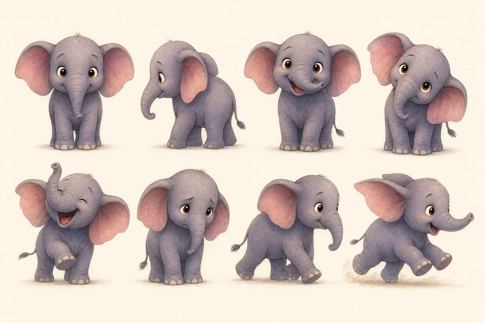

# Ellie Character Sheet
## Official AdventureBox MVP Character · Canon Reference

**Ellie is the face of AdventureBox.** Every future illustration must match this sheet.

---

## Character Sheet Art



**File:** `assets/ellie-character-sheet.png`  
**Poses included:** Front · Side · Happy · Curious · Laughing · Worried · Walking · Running

---

## Identity

| Field | Value |
|-------|-------|
| **Name** | Ellie |
| **Species** | African elephant calf |
| **Age** | ~3 elephant years (perpetually young) |
| **Role** | AdventureBox MVP hero · The Heart |
| **Companion** | Tiny Duck (story-specific; may return) |

---

## Proportions (Locked)

| Measurement | Ratio |
|-------------|-------|
| Head : body height | ~1 : 1.2 (big head, appeal-first) |
| Ear width : head width | ~1.4 : 1 (oversized floppy ears) |
| Trunk length | Short — reaches chest when hanging |
| Eye : face width | ~0.22 (large, focal) |
| Leg length | Short, stubby, slightly clumsy |
| Tusks | **None** — always |

---

## Color Palette (Locked)

| Part | Hex | Notes |
|------|-----|-------|
| Body midtone | `#B2BEC3` | Warm gray-violet, never cool blue-gray |
| Body highlight | `#DFE6E9` | Top of head, trunk ridge |
| Body shadow | `#636E72` | Warm, never pure gray |
| Ear interior | `#FAB1A0` | Soft pink |
| Eye iris | `#6D4C41` | Amber-brown |
| Eye catchlight | `#FFFFFF` | Always two: main + secondary |
| Cheek blush | `#FD79A8` at 15% | Subtle, optional on laugh beats |

---

## Facial Features (Locked)

- **Eyes:** Almond-shaped, amber-brown, long dark upper lashes, white catchlights mandatory
- **Brows:** Soft arcs — emotion reads through brow + trunk, not harsh lines
- **Trunk:** Primary expression tool — curls when curious, droops when sad, sprays when surprised
- **Mouth:** Small, usually hidden behind trunk except on laugh/surprise beats
- **Hair:** Small tuft of dark fur on crown (3–5 strands)

---

## Expression Guide

| Expression | Eyes | Trunk | Ears | Body |
|------------|------|-------|------|------|
| **Happy** | Bright, curved lids | Upward curl | Relaxed outward | Weight even |
| **Curious** | Wide, one brow up | Raised, tilted | One forward | Head tilt |
| **Laughing** | Closed crescents | High, open spray | Flung back | One foot up |
| **Worried** | Larger, glistening | Low, curled inward | Drooped | Hunched slightly |
| **Walking** | Calm forward | Swinging gently | Neutral | Mid-stride |
| **Running** | Focused forward | Extended | Pinned back | Lean forward |

---

## Tiny Duck (Supporting — This Story)

| Part | Hex |
|------|-----|
| Body | `#FFEAA7` |
| Cheek warm | `#FDCB6E` |
| Beak | `#E17055` |
| Eye | `#2D3436` |

**Scale:** Never larger than Ellie's foot. Fluffy ball of down.

---

## Consistency Rules

1. Ellie gray tone must match sheet within one shade on any page
2. Ear inner pink always visible on front/side views
3. Eyes always amber-brown — **never blue** (regenerate if drift occurs)
4. No tusks, ever
5. Painterly watercolor style — soft edges, visible texture, no vector outlines

---

## Regeneration Prompt (Canonical)

```
Ellie, AdventureBox official baby elephant calf. Warm gray-violet body (#B2BEC3), 
pink inner ears (#FAB1A0), amber-brown eyes (#6D4C41) with white catchlights, 
short stubby trunk, no tusks, big head child proportions, small tuft on crown. 
Painterly digital watercolor children's book style, Pixar emotional appeal, 
soft edges, cold-press paper texture. MATCH CHARACTER SHEET EXACTLY.
```

---

*Ellie Character Sheet v1.0 · Focus Sprint · Canon until revised by Product Owner*
