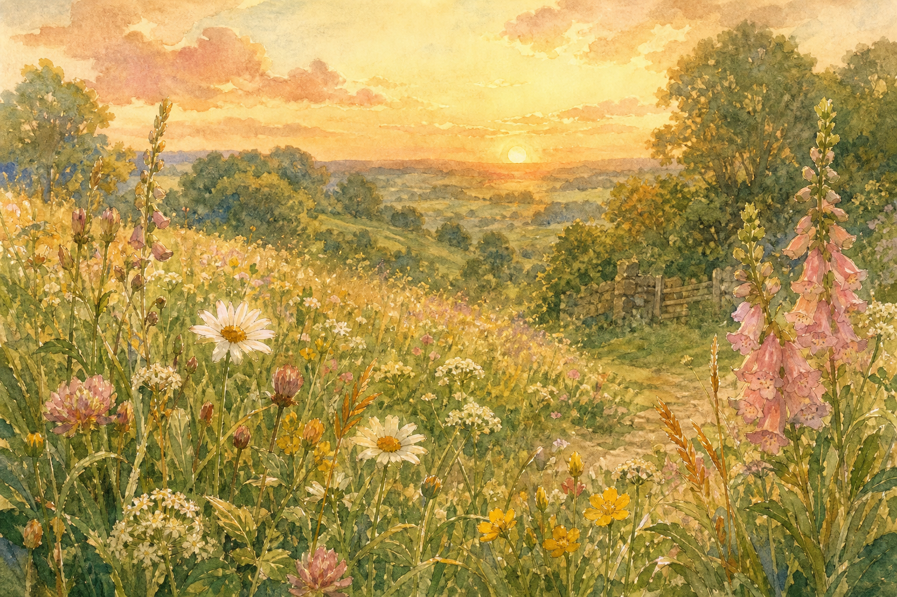
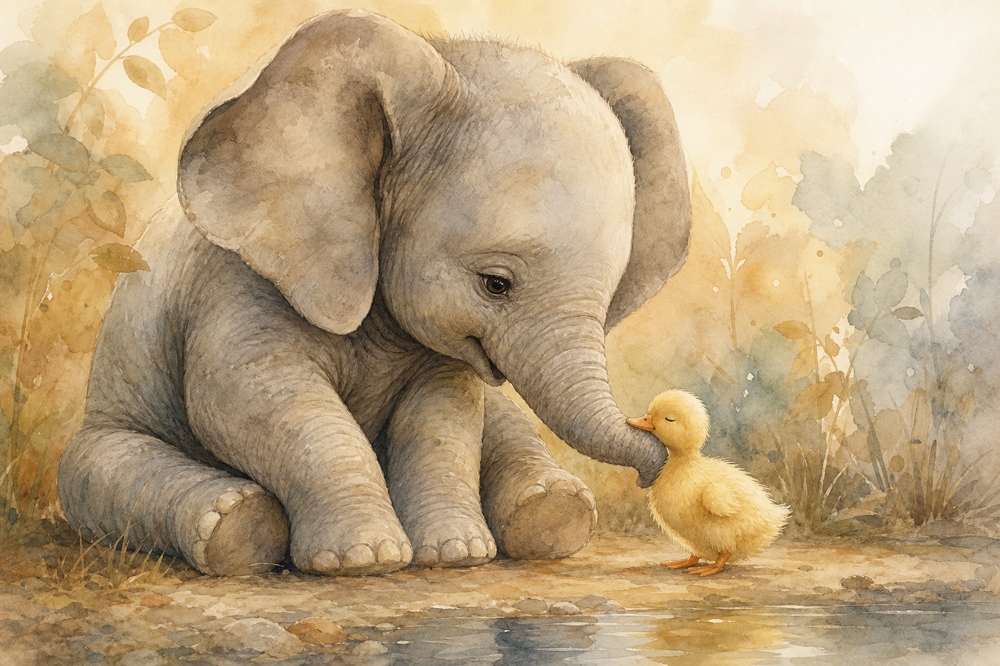
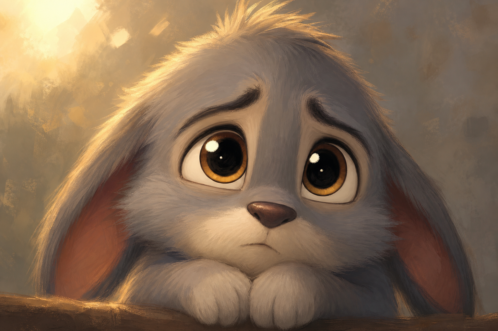
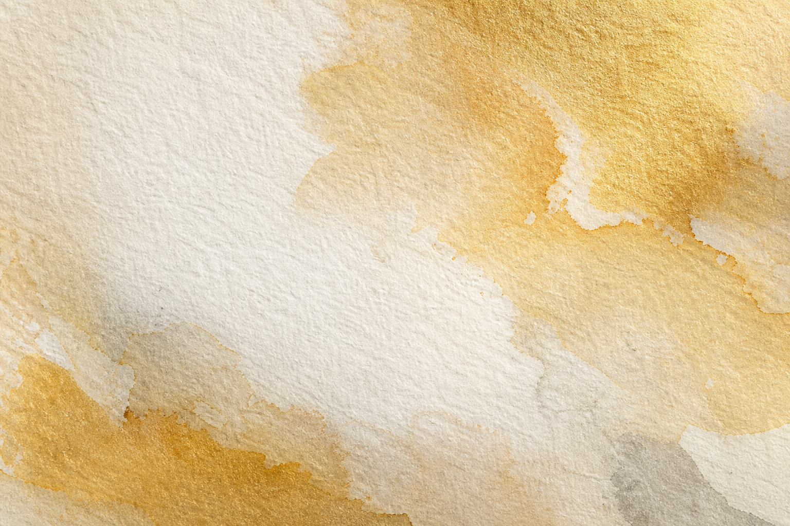
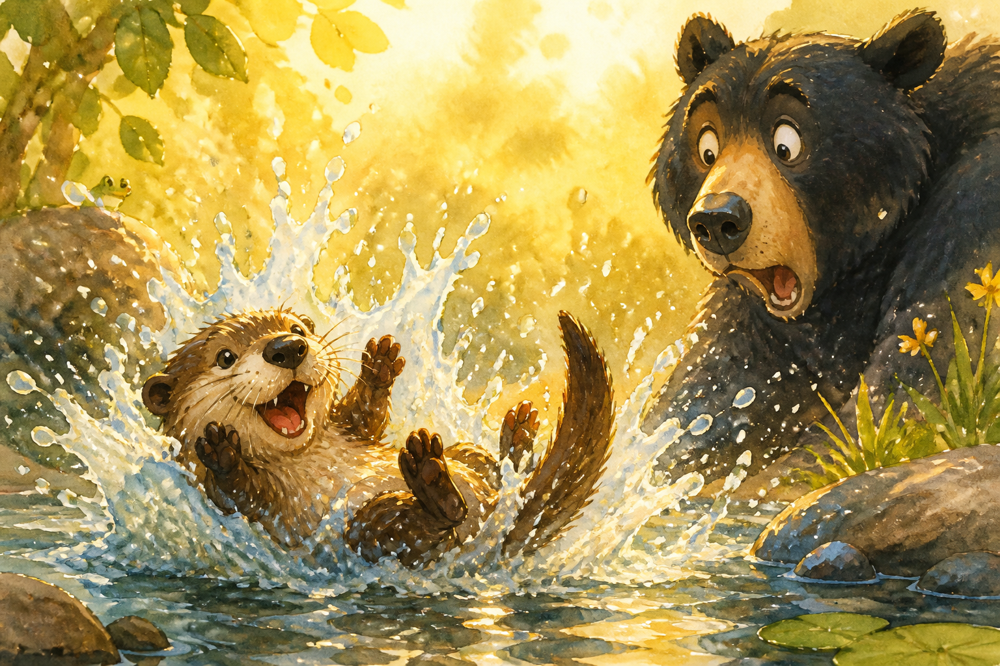
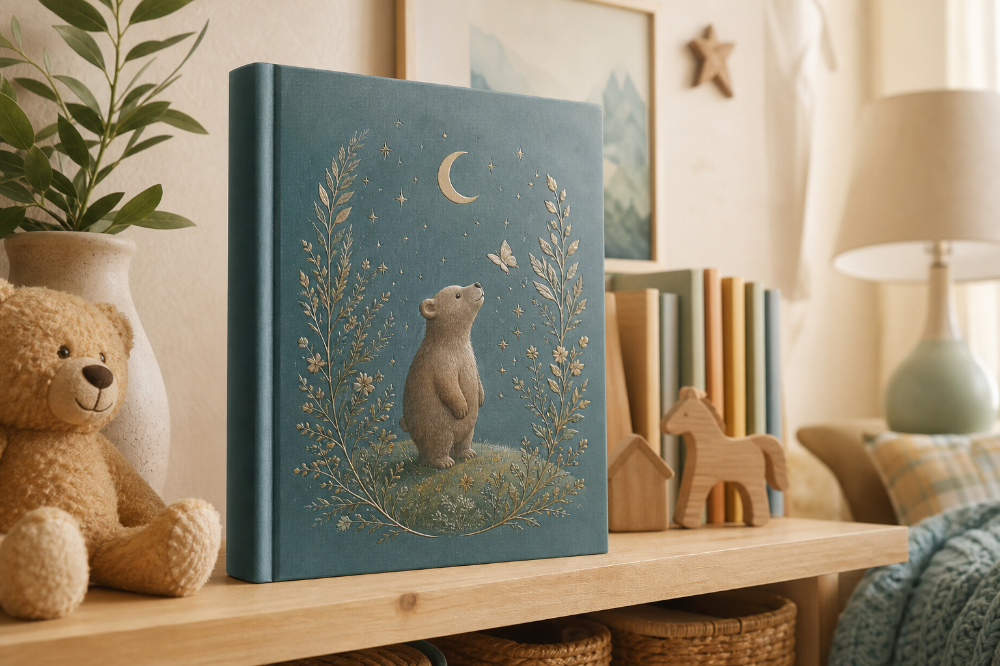
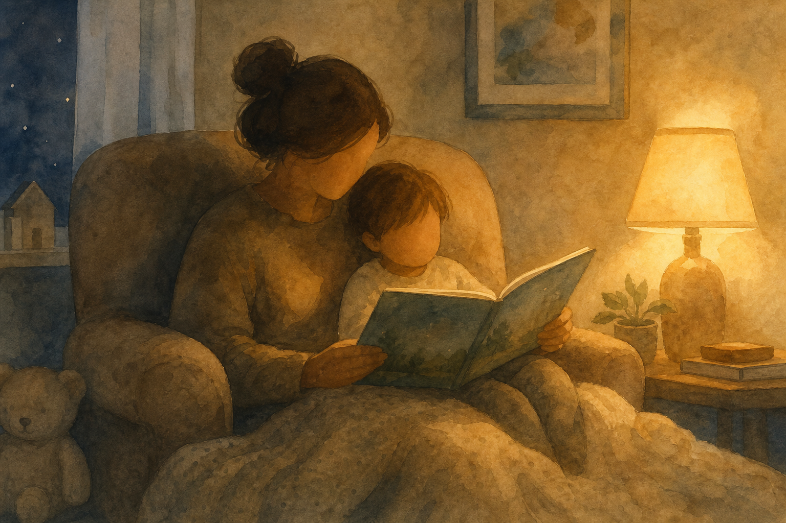
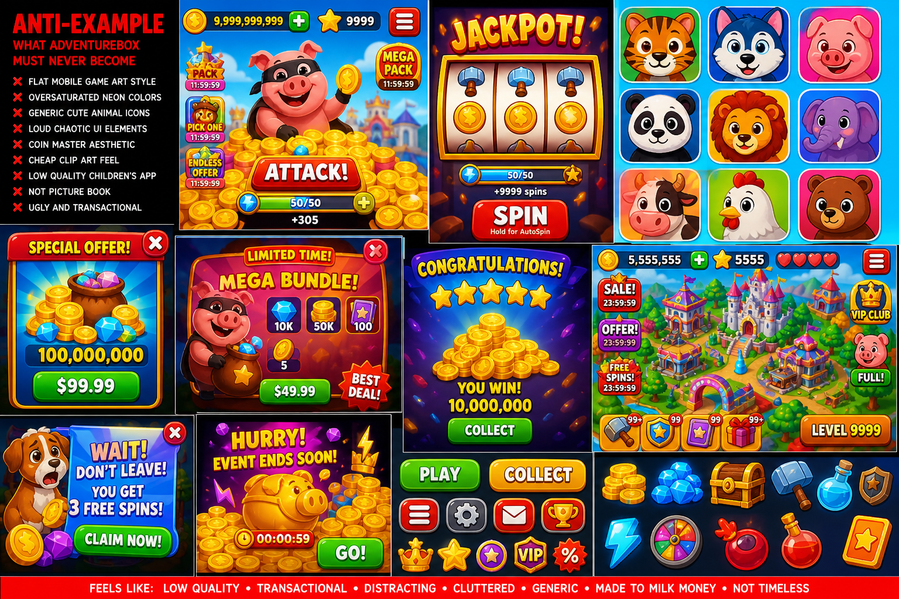
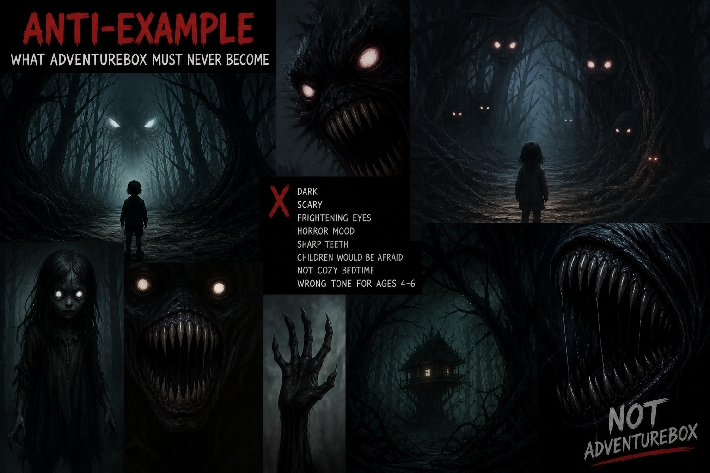
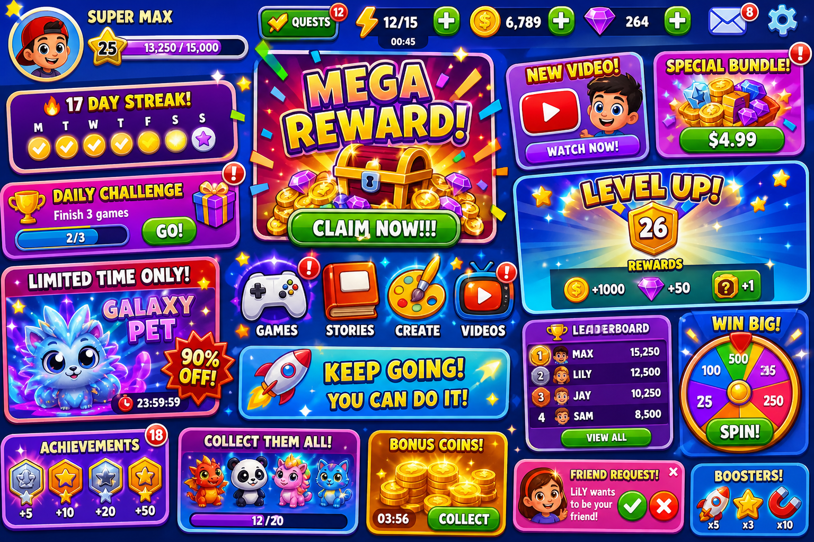

# Visual Mood Board
## AdventureBox · Ellie MVP

Text-only mood boards are retired. This board uses **reference imagery**.

---

## Inspiration — What AdventureBox IS

| # | Image | Why it's here |
|---|-------|---------------|
| 1 |  | **Light.** Golden hour meadow — Ellie's world |
| 2 |  | **Heart.** Size contrast, gentle friendship |
| 3 |  | **Soul.** Eyes carry the story |
| 4 |  | **Ending.** Page 5 belongs here |
| 5 |  | **Craft.** Hand-painted, not digital-flat |
| 6 |  | **Laugh.** Page 4 energy |
| 7 |  | **Product.** Parents buy books for shelves |
| 8 |  | **Ritual.** Parent + child, not child + screen alone |

---

## Anti-Examples — What AdventureBox is NOT

| # | Image | Why we reject it |
|---|-------|------------------|
| A |  | Neon flat vectors — cheap app, not picture book |
| B |  | Fear — wrong for ages 4–6 bedtime |
| C |  | Streaks, coins, noise — YouTube Kids guilt |

---

## One-Breath Summary

**Warm. Painted. Gentle. Funny once. Safe always.**

---

*Visual Mood Board v1.0 · Focus Sprint*
